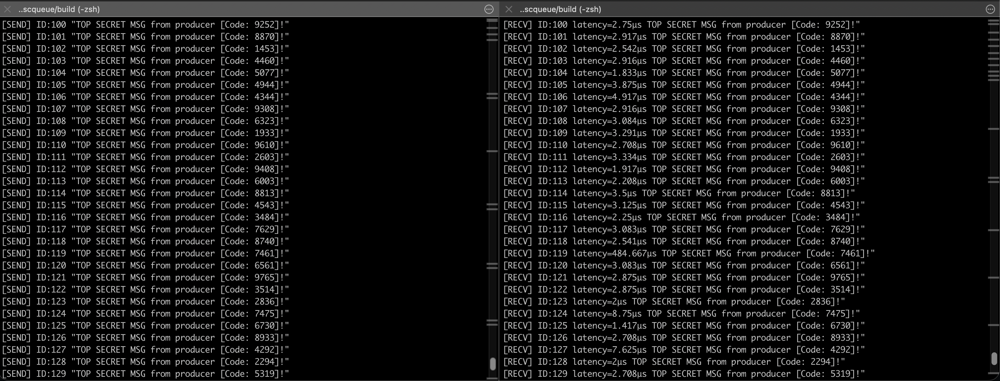

# SPSCQueue
Single Producer Single Consumer Lock Free Queue supporting interthread and shared memory interprocess communication.



## Build & Run
```bash
mkdir build && cd build
cmake ..
make
./main
```

## Test
```bash
# Regular
cd build && ctest --output-on-failure
# Stress Test
cmake -B build -DENABLE_TSAN=ON && cmake --build build --target test_stress && ./build/test_stress
```

